# La bioinformática como herramienta en el diagnóstico oncológico.
### Frida Fernanda López Pérez            frifer123ONLY
### Joanna Lizeth Sánchez Rangel          JoannaLizSR

## Introducción:
La lucha contra el cáncer ha avanzado mucho en los últimos 30 años, al igual que ha mejorado la tasa de supervivencia, sin embargo aún es dificil alcanzar una cura generalizada. El desafío reside en que cada caso es único, incluso es considerada un enfermedad multifactorial. Los avances recientes en la comprensión de los mecanismos moleculares que subyacen al cáncer están transformando el diagnóstico y el tratamiento de la enfermedad. Es por esto, que se deben incluir disntintas disciplinas en el desarrollo de nuevas técnicas para diagnósticos tempranos de cualquier tipo de cáncer, cabe mencionar que estas tecnologías generan datos masivos (Big Data) que requieren de herramientas analíticas y personal capacitado para su análisis, integración y transferencia de la información hacia los médicos especialistas. Pero en  particular, analizaremos el uso de la bioinformática como herramienta en el diagnóstico oncológico.

El cáncer es la tercera causa de muerte en México, por esta enfermedad fallecen 14 de cada 100 personas y la esperanza de vida de quienes la padecen es de 63 años. Su mortalidad está creciendo de manera acelerada, pues entre 1990 y 2019 el número de muertes se duplicó: de 41 a 89 mil personas (inegi, 2020). Además, se ha estimado que el cáncer genera costos directos e indirectos de entre 23 y 30 mil millones de pesos anuales, lo cual representa una quinta parte del presupuesto total del Instituto de Salud para el Bienestar (Insabi) en 2020. También es considerada por varios especialistas la "nueva pandemia" puesto que se estima que para 2030 se corrre el riesgo que se dupliquen o tripliquen los casos.

La incidencia del cáncer, en general, es mayor en las personas y regiones de ingresos medios y altos, sin embargo, también afecta de manera significativa a los estratos socioeconómicos menos aventajados. Las personas que experimentan desigualdades sociales en México viven en contextos menos propicios para
prevenir el cáncer y, en general, para acceder a sistemas de atención oportunos, efectivos y de calidad.

La bioinformática es una disciplina clave para comprender los cambios géneticos que se presentan en los distintos ambientes del cáncer y de esta manera ofrecer diagnosticos tempranos y mejores tratamiento, aumentando el pronóstico de vida. Los enfoques basados en la bioinformática tienen la capacidad de transformar la gran cantidad de datos biológicos en modelos integrales que brindan una comprensión profunda de la enfermedad del cáncer y las complejas relaciones genotipo-fenotipo necesarias para identificar las alteraciones moleculares que impulsan el cáncer y los nuevos objetivos terapéuticos. Además, la constante reducción de costes de dichas tecnologías hace preveer que los factores de tipo económico no supondrán un obstáculo importante para su incorporación a la clínica. En este contexto, la bioinformática se ha mostrado como una disciplina capaz de integrar información de distintos tipos y realizar predicciones y modelos virtuales que pueden ser muy orientativos y aplicables en el ámbito clínico.

## Objetivo: 
Este documento tiene como objetivo mostrar que la bioinformática es un excelente aliado en la medicina para entender, desarrollar tratamientos y diagnosticar el cáncer. Centrandonos en México como el contexto de desarrollo del presente trabajo, debido a que es uno de los paises subdesarrollados con mayor indice de cáncer y mortalidad en el mismo.

## Hipótesis:

## Diagrama metodológico:
Se realizó una encuesta a 12 participantes, donde todos ellos son estudiantes de medicina y médicos.
Las preguntas que se realizaron fueron las siguientes:

1. Indica tu edad
2. Indica tu sexo
3. ¿Sabes qué es la bioinformática?
4. ¿Conoces a algún bioinformático? 
5. ¿Conoce alguna herramienta tecnológica auxiliar en el diagnóstico de cáncer?
6. Durante sus prácticas médicas, ¿Alguna vez mencionaron la secuenciación y análisis de genes como un factible camino de diagnóstico en algún paciente?
7. En la práctica, ¿Cuál es el enfoque al que se le da mayor prioridad?
        - Diagnóstico
        - Tratamiento
8. ¿Considera la automatización del diagnóstico de cáncer una buena opción? Sí / No...¿Por qué?
9. ¿Tienes conocimiento acerca de la medicina personalizada?
10. La medicina personalizada se basa en....
        - Llevar acabo el mismo tratamiento para las personas con un mismo tipo de cáncer.
        - La atención medica de acuerdo a sus genes y enfermedad específica.
        - Las dos opciones mencionadasanteriormente.
11. ¿La carrera le ha brindado las suficientes herramientas para entender como se relaciona la secuenciación genética con un mejor diagnóstico?
12. ¿Usted cree que es importante la unión de diferentes disciplinas en el área médica ? (ciencias de la computación, biología y matemáticas)

## Resultados:
Se obtuvieron respuestas de 12 participantes (3 mujeres y 9 hombres), los cuales son estudiantes de medicina y médicos. Las es edades de estos participantes se encuentran entre 21 (n=1), 22 (n=1), 24 (n=1), 27 (n=1), 33 (n=3), 50 (n=1), 52 (n=1) y 55 (n=2) años. 

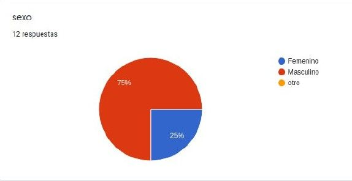

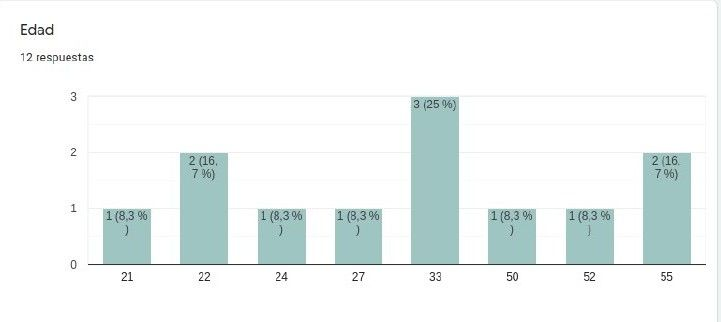

Todos los partipantes (n=12, 100%) tienen una idea clara de lo que es la bioinformática.

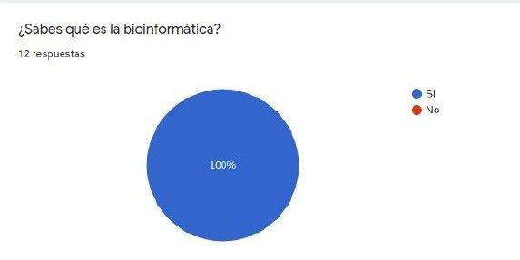

El 33.3% (n=4) de lo participantes manifiestan conocer un bioinformático, mientras que el 66.7% (n=8) respondió que no conocen a un bioinformático.

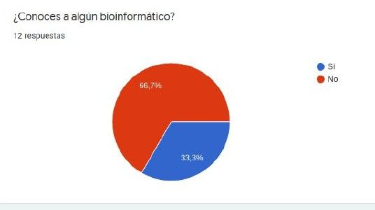

El 91.7% (n=11) de los participantes dice conocer alguna herramienta tecnológica auxiliar en el diagnóstico de cáncer, mientras que sólo el 8.3% (n=1) dice no conocer ninguna herramienta de este tipo.

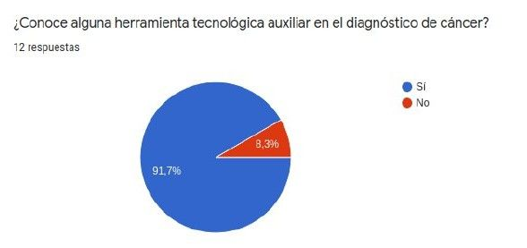

El 66.7% (n=8) de los participantes afirma que durante sus prácticas médicas le mencionaron la secuenciación y análisis de genes como un factible camino de diagnóstico en algún paciente. Sin embargo, el 33.3% (n=4) respondió negativamente.

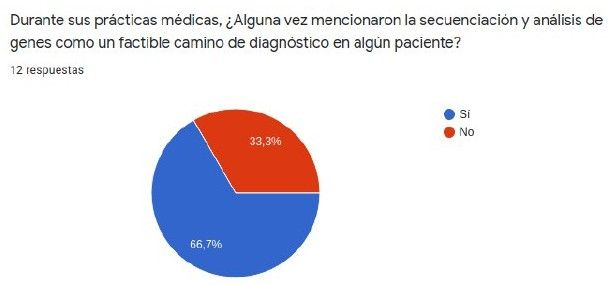

El 58.3% (n=7) de los participantes menciona que en la práctica el aspecto al que se le da más prioridad es el tratamiento, mientras que el 41.7% (n=5) contestó que el aspecto con mayor prioridad en la práctica es el diagnóstico.

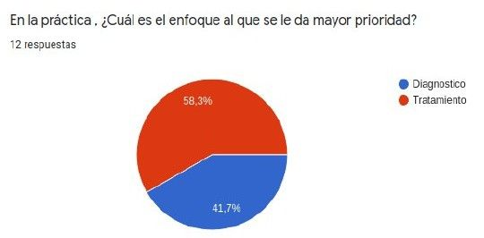

El 100% (n=12) de los participantes consideran que la automatización del diagnóstico de cáncer es una buena opción. Así mismo, el 100% de los participantes contestaron que los diagnósticos serían mas rápidos y precisos que los convencionales con estas nuevas herramientas.

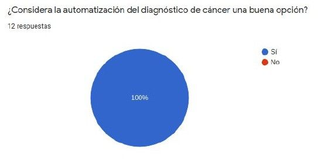

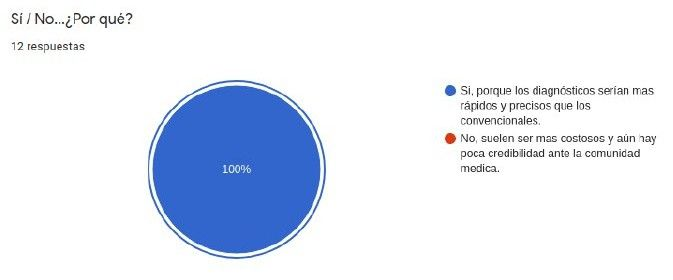

El 66.7% (n=8) de los participantes tienen conocimiento acerca de la medicina personalizada, mientras que el 33.3% (n=4) contestó no tener dicho conocimiento.

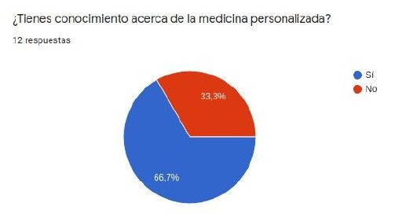

El 100% (n=12) de los participantes aseguró que la medicina personalizada se basa en la atención medica de acuerdo a sus genes y enfermedad especifica.

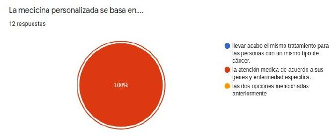

El 33.3% (n=4) de los participantes considera que la carrera le ha brindado las suficientes herramientas para entender como se relaciona la secuenciación genética con un mejor diagnóstico. Sin embargo, el 66.7% (n=8) de los participantes considera lo contrario.

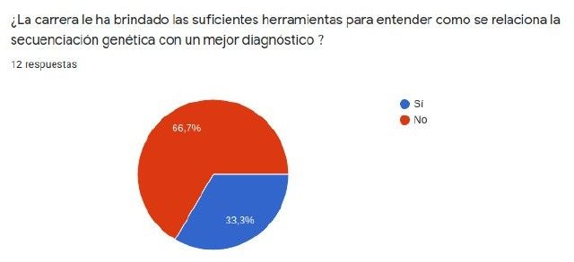

El 100% (n=12) de los participante creen que es importante la unión de diferentes disciplinas en el área médica, como las ciencias de la computación, biología y matemáticas. 

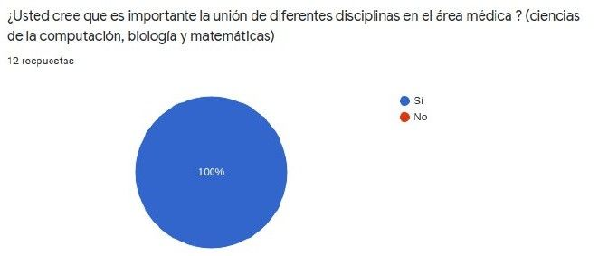

## Conclusiones: 
En general podemos decir, que a pesar de que los estudiantes de medicina y médicos tengan conocimientos de las nuevas herramientas desarrolladas basadas en el estudios de la bioinformática, esto no sirve de mucho pues si estos conocimientos no son se llevan a la práctica y se usa para la prevención y detección temprana de cáncer, en especial hacer diagnósticos más precisos en pacientes con cáncer. Podemos notar que existen distintos factores para que estas herramientas no se usen, la más destacada es la desigualdad social; en todo el ciclo de atención y control del cáncer, las personas que experimentan desventajas vinculadas con su nivel de ingreso, su género, su lugar de residencia o su afiliación a la seguridad social enfrentan mayores riesgos. En otros términos, las personas de altos ingresos, las que residen en zonas urbanas y las afiliadas a la seguridad social parecen estar mejor protegidas frente al cáncer: aunque hay variaciones según el tipo, su probabilidad de adquirirlo suele ser más baja y la de acceder a tratamiento efectivo, más elevada. Para impulsar a México se tienen aún que hacer un programa intregal de prevención y control del  de cáncer a nivel nacional, haciendo notar a las autoridades del sector salud el beneficio en aspectos económicos para nuestro pais y por consecuencia un mejor servicio de salud descentralizado para la población mexicana.

## Referencias:
1. Flamand-Gómez, L., Moreno-Jaimes, C., Arriaga Carrasco R. (2020) Cáncer y desigualdades sociales en México 2020. Ciudad de México : El Colegio de México, Red de Estudios Sobre Desigualdades : ITESO, Universidad Jesuita de Guadalajara : Fundación de Alba : Respirando con Valor A.C. : Salvati A.C.
2. Reynoso-Noverón, N., Torres-Domínguez, J. (2020) Epidemiología del cáncer en México: carga global y proyecciones 2000-2020. Revista Latinoamericana de Medicina Conductual, 8(1),9-14.
